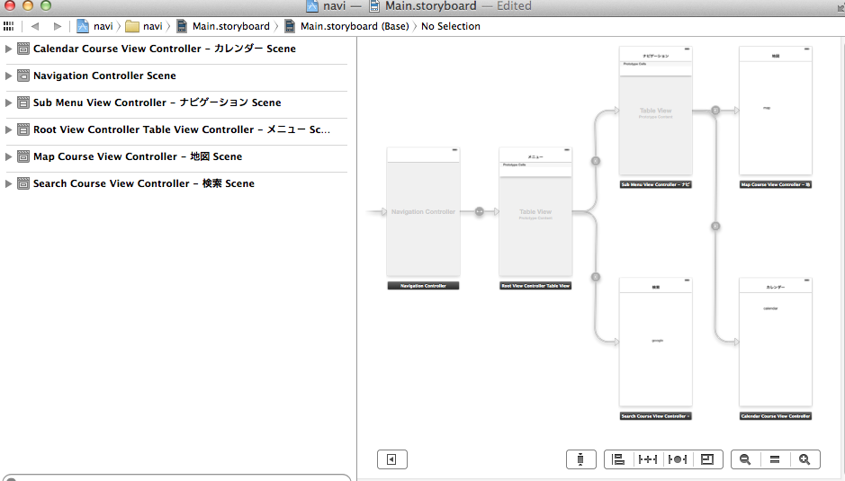
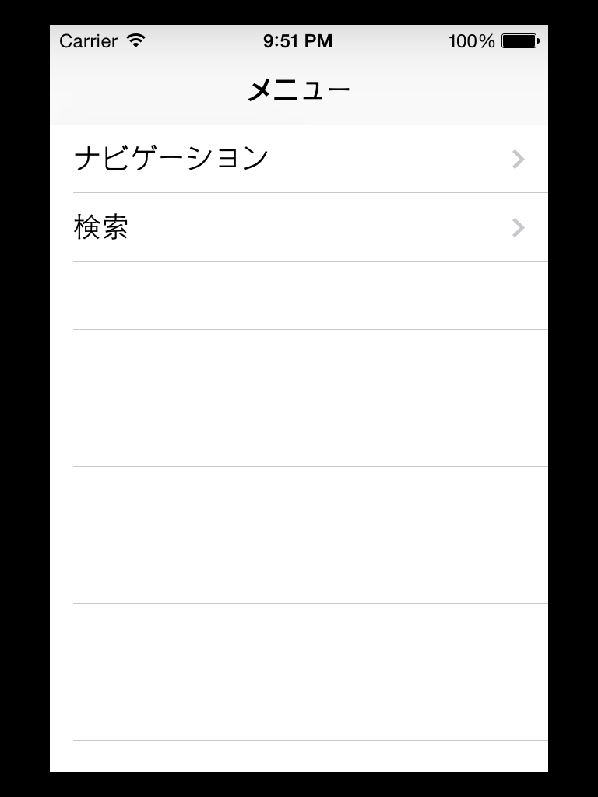
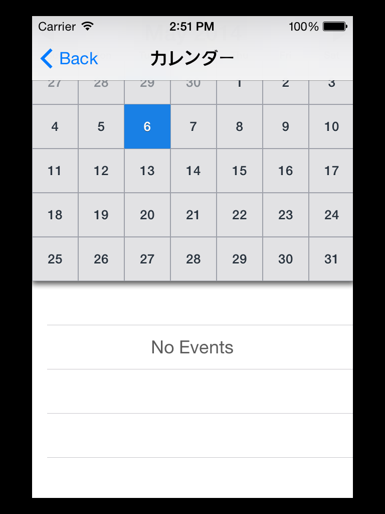

ios-navi
========

ios の練習

See
- http://www.sotechsha.co.jp/sp/1008/　詳細！ (Objective-C iPhoneアプリ開発入門ノート)  
　　PART 8 シーンの移動
- https://www.youtube.com/watch?v=AmMF7hWrYZk Xcode 5 Tutorial | UIWebView

## スクリーンショット
 
 - storyboard
   
 
 
 
  
  